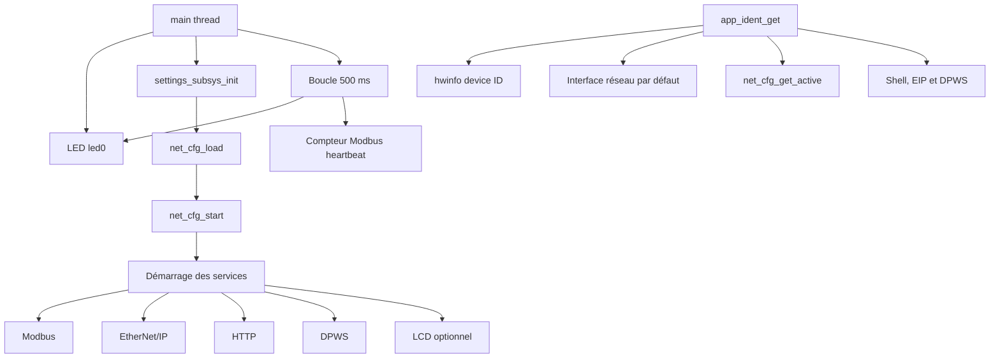

# Orchestration et identité

Le module `core` démarre le firmware et centralise l'identité publiée par les
différents protocoles. Il ne doit pas contenir la logique interne d'un
protocole.

## Fichiers et responsabilités

| Fichier | Responsabilité |
|---|---|
| `main.c` | ordre d'initialisation, événement DHCP, LED et heartbeat |
| `ident.h` | constantes d'identité, structure publique et tailles de chaînes |
| `ident.c` | collecte et formatage de l'identité, commande shell `ident` |

## Architecture



## Contexte d'exécution

| Élément | Nom | Stack | Priorité | Remarque |
|---|---|---:|---:|---|
| point d'entrée | `main` | 4096 octets | 0 | `CONFIG_MAIN_STACK_SIZE` et `CONFIG_MAIN_THREAD_PRIORITY` |
| callback DHCP | thread net management | 2048 octets | défaut Zephyr | journalise l'adresse reçue |
| commande `ident` | thread shell Zephyr | 2048 octets | défaut Zephyr | aucun thread propre à `ident` |

La boucle `main` ne doit jamais effectuer d'opération longue : elle cadence la
LED et `app_modbus_tcp_heartbeat_tick()` toutes les 500 ms.

## Contrat d'identité

`app_ident_get()` remplit une photographie de l'identité au moment de l'appel :

- constantes : nom du device, fabricant, modèle et version firmware ;
- `hwinfo_get_device_id()` : identifiant matériel STM32, formaté en hexadécimal ;
- interface Zephyr : MAC et IPv6 link-local ;
- `net_cfg_get_active()` : IPv4 réellement active ;
- UUID actuel : format déterministe construit à partir des six octets de MAC.

Les chaînes `unavailable` et `0.0.0.0` indiquent qu'une information réseau n'est
pas encore prête. `ipv6_preferred` distingue une adresse link-local utilisable
d'une adresse encore tentative pendant DAD.

## Dépendances et règles de modification

- Modifier la version firmware uniquement via
  `APP_IDENT_FW_VERSION_MAJOR/MINOR/PATCH`.
- Ajouter un champ commun dans `struct app_ident_info`, puis mettre à jour tous
  ses consommateurs, en particulier DPWS et la commande `ident`.
- Ne pas déplacer dans `ident` les identifiants propres à un protocole : Product
  Code et numéro de série CIP restent dans EIP, signature/version de mapping
  restent dans Modbus.
- L'UUID actuel dépend de la MAC configurée par Zephyr. Si sa stratégie change,
  vérifier la stabilité de l'EndpointReference DPWS.

## Diagnostic

Sur l'UART :

```text
ident
uptime
ip show
```

Au boot, chercher `DHCP bound`, les messages `ready/listening` de chaque service
et une adresse IPv6 en état preferred. Après une modification de l'ordre de
démarrage, vérifier les modes DHCP et statique.
