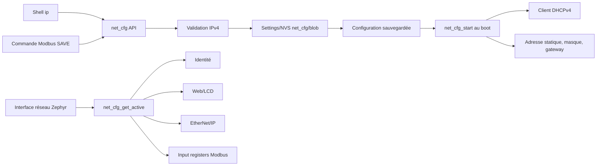

# Configuration réseau

`net_cfg` possède la configuration IPv4 sauvegardée et fournit l'état réseau
actif au reste de l'application. IPv6 link-local est géré par la pile Zephyr et
n'est pas persisté par ce module.

## Architecture



## Exécution et synchronisation

Ce module ne crée aucun thread.

| Opération | Contexte habituel | Synchronisation |
|---|---|---|
| chargement et démarrage | `main` | séquentiel au boot |
| lecture depuis Web/LCD/EIP/ident | thread appelant | copie protégée par `cfg_lock` |
| sauvegarde depuis Modbus | `modbus_cmd_wq` | Settings puis mise à jour sous mutex |
| commandes `ip` | thread shell | API publique et mutex |
| callback de changement | thread appelant | un seul callback enregistré |

`cfg_lock` protège la structure RAM `cfg`. Le callback est volontairement
unique et actuellement enregistré par Modbus pour resynchroniser ses holding
registers après une sauvegarde.

## Persistance

| Élément | Valeur |
|---|---|
| clé Settings | `net_cfg/blob` |
| magic | `0x4e455443` |
| version du blob | `1` |
| mode par défaut | DHCP |
| IP de repli | `192.168.0.3` |
| masque de repli | `255.255.255.0` |
| gateway de repli | `192.168.0.1` |

Le chargement valide magic, version et chaînes IPv4. Il sait migrer une ancienne
configuration stockée dans les clés séparées `net_cfg/mode`, `ip`, `mask` et
`gw`. Une configuration invalide restaure les valeurs par défaut puis réécrit
un blob valide.

## Configuration sauvegardée et configuration active

- `net_cfg_get_saved()` retourne ce qui sera appliqué au prochain boot.
- `net_cfg_get_active()` inspecte l'interface Zephyr et retourne l'adresse
  réellement active, notamment le bail DHCP courant.
- `net_cfg_set_saved()` ne reconfigure pas l'interface à chaud ; un reboot est
  nécessaire.
- `net_cfg_link_is_up()` exige une interface UP avec carrier Ethernet présent.

Cette distinction explique pourquoi `ip show` peut afficher une valeur
sauvegardée différente de celle annoncée par DPWS ou le dashboard.

## Commandes UART

```text
ip show
ip dhcp
ip static 192.168.0.3 255.255.255.0 192.168.0.1
reboot
```

## Points d'attention

- Toute nouvelle version de `struct net_cfg_store` doit incrémenter
  `NET_CFG_STORE_VER` et fournir une migration ou un retour contrôlé aux
  valeurs par défaut.
- Ne jamais écrire directement dans `cfg` hors des fonctions du module.
- `net_cfg_set_saved()` appelle le callback après la persistance ; le callback
  ne doit pas rappeler une sauvegarde de manière récursive.
- Après changement réseau, tester DHCP, statique, reboot et coupure de lien.
