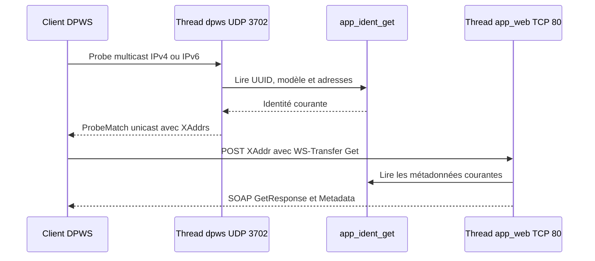

# DPWS et WS-Discovery

Ce module découvre la carte par WS-Discovery et expose ses métadonnées DPWS par
WS-Transfer. La découverte UDP appartient à `app_dpws.c`; le transport HTTP des
métadonnées est volontairement délégué au serveur Web.

## Architecture



## Contexte d'exécution

| Élément | Valeur |
|---|---|
| nom du thread | `dpws` |
| stack | 4096 octets |
| priorité | 8 |
| sockets | UDP IPv6 et UDP IPv4 |
| taille requête/réponse UDP | 2048 octets chacune, buffers statiques |
| buffer XML metadata | 4096 octets, possédé par `app_web.c` |

Le thread attend une interface UP et une IPv6 link-local preferred. Il crée
ensuite ses listeners et les sert par `poll()`. Une réponse ProbeMatch est
retardée pseudo-aléatoirement de 0 à 500 ms pour limiter les collisions entre
plusieurs devices.

## Endpoints et standards utilisés

| Élément | Valeur |
|---|---|
| WS-Discovery IPv4 | `239.255.255.250:3702` |
| WS-Discovery IPv6 | `[ff02::c]:3702` |
| metadata HTTP | `/dpws/<device-uuid>` sur le port 80 |
| WS-Discovery supporté | 2005/04 et OASIS 2009/01 |
| WS-Addressing supporté | 2004/08 et 2005/08 pour la découverte |
| WS-Transfer metadata | 2004/09 |
| Device Profile namespace | 2006/02 |

Les réponses sont unicast vers l'adresse et le port source du Probe. `XAddrs`
place d'abord la famille IP par laquelle la requête a été reçue, puis l'autre
famille si elle est disponible.

## Répartition des responsabilités

`app_dpws.c` :

- rejoint les groupes multicast IGMP et MLD ;
- reconnaît un Probe, sélectionne le profil 1.0 ou 1.1 ;
- construit EndpointReference, Types, Scopes, XAddrs et AppSequence ;
- valide le chemin metadata et construit le document WS-MetadataExchange.

`app_web.c` :

- accepte le POST HTTP sur le XAddr ;
- appelle `app_dpws_build_metadata()` ;
- retourne `application/soap+xml`.

`ident.c` est la source des valeurs publiées. Ne dupliquer ni nom, ni version,
ni MAC dans DPWS.

## Métadonnées

Les sections standard `ThisModel` et `ThisDevice` publient fabricant, modèle,
URL de présentation, nom convivial, firmware et numéro de série matériel. Une
section d'extension `urn:industrial-ethernet:device-info` ajoute ProductCode,
capabilities, hardware revision, node name, uptime, services, MAC, IPv4, IPv6
et UUID.

Le UUID de l'EndpointReference doit rester stable entre les boots. Un changement
de stratégie UUID doit prévoir la compatibilité avec les clients qui mémorisent
l'ancien endpoint.

## Limites actuelles

- pas de messages Hello/Bye à l'arrivée ou au départ du réseau ;
- parsing SOAP volontairement minimal avec recherche de chaînes, sans parseur
  XML complet côté firmware ;
- pas de Hosted Services, WSDL, WS-Eventing ni sécurité DPWS ;
- metadata servie en HTTP clair ;
- une seule requête est traitée à la fois par chaque thread UDP/HTTP.

Il s'agit d'un device DPWS de découverte et métadonnées, pas encore d'une pile
DPWS exhaustive.

## Configuration requise

`prj.conf` doit conserver UDP, IPv4 IGMP, IPv6, MLD et assez de contextes réseau.
Le serveur HTTP doit démarrer avant DPWS pour que les XAddrs annoncés soient
immédiatement utilisables.

## Validation

```bash
python tools/dpws_probe.py
python tools/dpws_probe.py --interface-index 11
```

Dans Wireshark, filtrer `udp.port == 3702 || http`. Vérifier le Probe multicast,
le ProbeMatch unicast, puis le POST HTTP et le GetResponse. Tester IPv4 et IPv6,
et comparer toutes les valeurs avec la commande UART `ident`.
