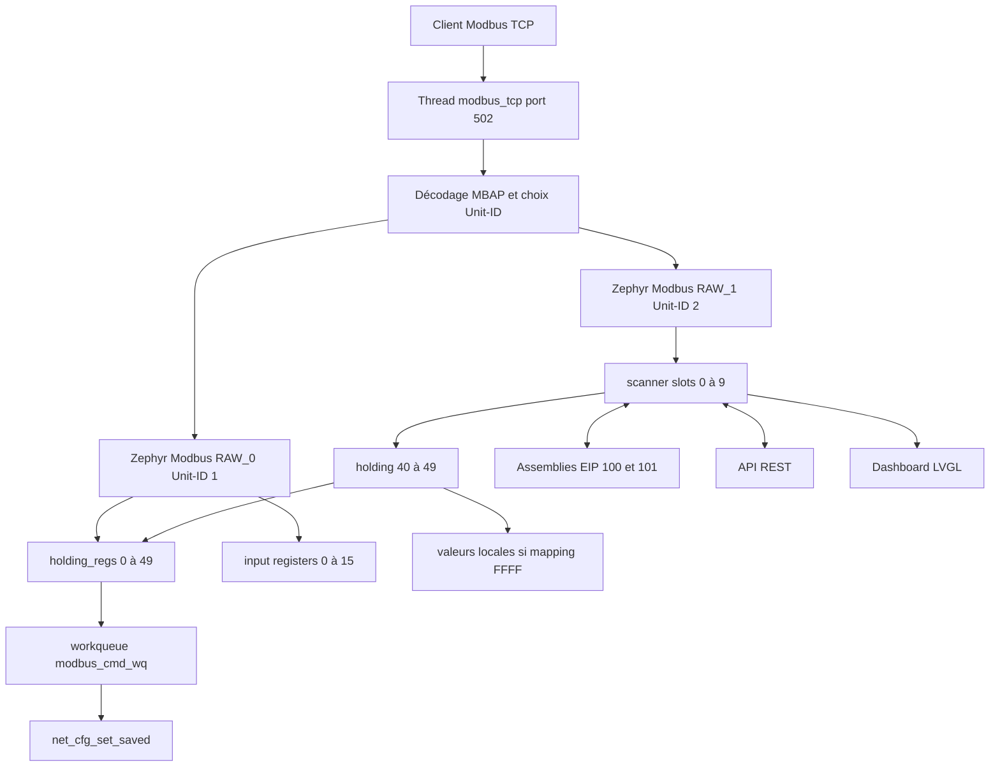

# Modbus TCP et fenêtre scanner

Ce module implémente le serveur Modbus TCP IPv4 sur le port 502, le contrat de
50 holding registers du Unit-ID 1 et une fenêtre dynamique de 10 mots sur le
Unit-ID 2. Cette fenêtre est également le contrat d'échange avec EtherNet/IP,
le Web et le LCD.

## Architecture

## Threads et synchronisation

| Fonction | Nom | Stack | Priorité | Blocage possible |
|---|---|---:|---:|---|
| serveur TCP | `modbus_tcp` | 4096 octets | 7 | `accept`, `recv`, réponse RAW |
| sauvegarde réseau | `modbus_cmd_wq` | 3072 octets | 8 | écriture Settings/NVS |

- `holding_regs_lock` protège les 50 holding registers et l'état de commande.
- `scanner_local_regs_lock` protège les dix valeurs locales du scanner.
- `raw_response_ready` synchronise le serveur socket avec le backend Modbus
  RAW Zephyr.
- `command_done` synchronise la FC d'écriture avec la sauvegarde asynchrone.
- Le serveur traite un client et une requête à la fois. Une connexion idle
  conserve le thread dans `recv` et bloque les nouveaux clients Modbus.

## Routage des Unit-ID

| Unit-ID | Vue | Fonctions principales |
|---:|---|---|
| 0 ou 1 | mapping principal | holding/input registers, FC standard et FC23 |
| 2 | fenêtre scanner | dix holding registers dynamiques, FC standard et FC23 |
| autre | non supporté | connexion arrêtée avec journal d'avertissement |

Le backend Zephyr traite les PDU via deux interfaces RAW, tandis que
`app_modbus_tcp.c` possède le framing TCP/MBAP et le socket réseau.

## Contrat Unit-ID 1

La source de vérité est `modbus_map.h`.

### Holding registers

| Adresse | Usage |
|---:|---|
| 0 | signature du mapping `0x0747` |
| 1 | mode réseau sauvegardé, DHCP 0 ou statique 1 |
| 2-3 | IPv4 sauvegardée, MSW puis LSW |
| 4-5 | masque sauvegardé |
| 6-7 | gateway sauvegardée |
| 8 | commande, `1` pour sauvegarder |
| 9 | résultat signé de la dernière commande, `0x7fff` pendant traitement |
| 10-39 | données utilisateur |
| 40-49 | mapping des slots scanner 0-9 |

### Input registers

| Adresse | Usage |
|---:|---|
| 0-1 | signature `0x0747` et version du mapping `1` |
| 2-3 | uptime en secondes, LSW puis MSW |
| 4-5 | mode actif et état du lien |
| 6-11 | IPv4, masque et gateway actifs |
| 12 | heartbeat 16 bits |
| 13 | dernier statut signé |
| 14 | nombre cumulé de connexions TCP acceptées |
| 15 | réservé |

`APP_MODBUS_MAP_SIGNATURE` identifie ce contrat de registres ; ce n'est ni un
Product Code CIP ni une version firmware.

## Fenêtre scanner

Au démarrage, le slot `N` pointe vers le holding register `10 + N`. Pour chaque
lecture ou écriture du Unit-ID 2 :

1. le module lit l'entrée de mapping `40 + N` du Unit-ID 1 ;
2. si elle contient `0xffff`, il utilise `scanner_local_regs[N]` ;
3. sinon l'accès est redirigé vers le holding register indiqué.

Seules les valeurs `0..49` et `0xffff` sont valides dans le mapping. Les
compteurs de diagnostic du scanner sont internes et ne sont pas exposés par
l'API actuelle.

## Sauvegarde de la configuration réseau

Une écriture de `1` dans le registre 8 soumet un work item à
`modbus_cmd_wq`. Celui-ci reconstruit les chaînes IPv4, appelle
`net_cfg_set_saved()`, remet la commande à zéro et publie le résultat dans le
registre 9. Le timeout appelant est de 5 s et le timeout RAW de 6 s.

## API utilisée par les autres modules

- `app_modbus_tcp_holding_read/write()` : Web et autres producteurs locaux ;
- `app_modbus_scanner_holding_reg_rd/wr()` : EIP, Web et LCD ;
- `app_modbus_tcp_connection_count()` et `heartbeat_count()` : Web/LCD ;
- `app_modbus_tcp_heartbeat_tick()` : boucle `main`.

Toujours passer par ces API pour conserver les contrôles de bornes et les
mutex.

## Validation

- lire les Unit-ID 1 et 2 et vérifier le mapping par défaut ;
- tester FC3, FC4, FC6, FC16 et FC23 ;
- modifier un slot vers `0xffff`, puis vérifier sa valeur locale ;
- sauvegarder DHCP/statique, rebooter et vérifier Settings ;
- garder un client Modbus connecté pendant les tests HTTP et EIP Class 1.
