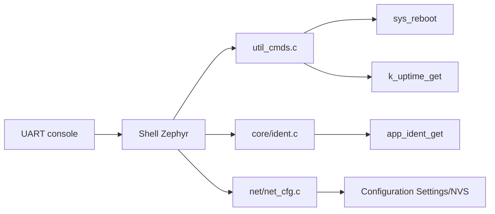

# Shell UART

Le shell est l'interface locale de mise au point et de maintenance. Le dossier
`shell` contient les commandes génériques ; certaines commandes sont
enregistrées dans le module propriétaire de leurs données.

## Architecture

## Contexte d'exécution

Le module ne crée aucun thread. Les handlers s'exécutent dans le thread du
backend shell Zephyr.

| Paramètre du build courant | Valeur |
|---|---:|
| nom logique | thread shell Zephyr |
| stack | 2048 octets, `CONFIG_SHELL_STACK_SIZE` |
| priorité | défaut Zephyr, `CONFIG_SHELL_THREAD_PRIORITY_OVERRIDE` désactivé |

Une commande doit donc éviter les boucles infinies et les attentes réseau
longues, sinon tout le shell UART devient indisponible.

## Commandes disponibles

| Commande | Propriétaire | Effet |
|---|---|---|
| `uptime` | `shell/util_cmds.c` | affiche le temps depuis le boot |
| `reboot` | `shell/util_cmds.c` | redémarrage froid immédiat |
| `ident` | `core/ident.c` | affiche identité, MAC, IPv4, IPv6 et UUID |
| `ip show` | `net/net_cfg.c` | affiche la configuration sauvegardée |
| `ip dhcp` | `net/net_cfg.c` | sauvegarde le mode DHCP |
| `ip static ...` | `net/net_cfg.c` | sauvegarde IPv4, masque et gateway |

Les commandes réseau prennent effet après reboot.

## Ajouter une commande

1. Placer le handler dans le module propriétaire des données.
2. Valider `argc`, les bornes et chaque conversion avant toute écriture.
3. Appeler une API publique du module plutôt que ses variables internes.
4. Enregistrer avec `SHELL_CMD_REGISTER` ou un sous-ensemble statique.
5. Documenter ici la commande et tester les entrées valides et invalides.

Ne jamais afficher de secret, clé ou mot de passe. Pour une opération lente,
déclencher un work item et retourner rapidement au shell.
