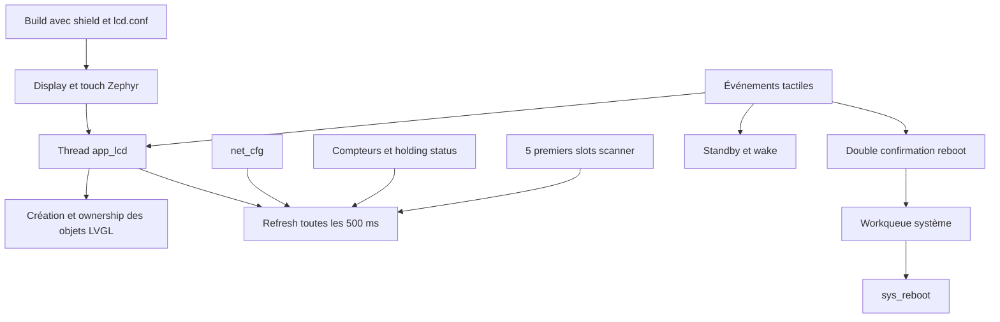

# Dashboard LCD et LVGL

Le module UI fournit un dashboard local 800 x 480 pour le shield LCD de la
STM32H747I-DISCO. Il est optionnel : sans LVGL ou sans display choisi dans le
devicetree, `app_lcd_start()` retourne `-ENODEV` et le reste du firmware continue.

## Architecture



## Contexte d'exécution

| Élément | Valeur |
|---|---|
| nom du thread | `app_lcd` |
| stack | 4096 octets |
| priorité | 9 |
| période boucle | 10 ms pour `lv_timer_handler()` |
| période données | 500 ms |
| état initial | écran en standby |
| slots scanner affichés | 5 sur 10 |

Tous les objets et appels LVGL sont possédés par `app_lcd`. Ne jamais mettre à
jour un label ou un widget depuis `main`, le Web, une callback réseau ou une
workqueue. Exposer une donnée thread-safe et la lire pendant `refresh_dashboard()`.

## Build conditionnel

Le code UI complet est compilé seulement si `CONFIG_LVGL` est actif et si le
devicetree définit `zephyr,display`. Deux contrôleurs de dalle sont supportés :

- `orisetech,otm8009a` ;
- `frida,nt35510`.

Commande de build :

```bash
west build -p always -b stm32h747i_disco/stm32h747xx/m7 app -- \
  -DSHIELD=st_b_lcd40_dsi1_mb1166 -DEXTRA_CONF_FILE=lcd.conf
```

Le build sans LCD compile un stub, ce qui permet de conserver le même appel
dans `main()`.

## Données affichées

- adresse IPv4 active et mode DHCP/statique ;
- état du carrier Ethernet ;
- nombre cumulé de connexions Modbus ;
- heartbeat ;
- dernier statut de commande Modbus ;
- cinq premières valeurs de la fenêtre scanner.

Les données viennent des API `net_cfg`, `app_modbus_tcp` et
`app_modbus_scanner`. Le dashboard ne possède aucune copie persistante.

## Standby et réveil

Au démarrage, le dashboard est créé et rafraîchi, puis le panel passe en
blanking avec luminosité à zéro. Une pression tactile pose
`lcd_wake_requested`; le thread LCD effectue ensuite le réveil, rétablit la
luminosité et rafraîchit l'écran. Cette séparation garde les opérations display
dans le thread propriétaire.

## Reboot sécurisé côté UI

Le premier clic arme une confirmation pendant 3 secondes et change le texte du
bouton. Un second clic dans cette fenêtre désactive le bouton et programme un
reboot après 300 ms. Sans confirmation, le bouton revient automatiquement à
son état normal.

Le handler de reboot s'exécute sur la workqueue système, stack 1024 octets et
priorité -1 dans le build courant.

## Ajouter une donnée ou un widget

1. Déclarer le pointeur LVGL dans `app_lcd.c`.
2. Créer le widget dans `create_dashboard()` ou une fonction appelée par elle.
3. Lire la donnée via une API thread-safe dans `refresh_dashboard()`.
4. Ne pas bloquer la boucle de 10 ms.
5. Vérifier la lisibilité, le tactile, le standby et les deux révisions de dalle.

## Validation

Tester boot écran allumé puis standby, réveil tactile, rafraîchissement, bouton
Sleep, confirmation/expiration du reboot et absence d'accès LVGL depuis un
autre thread. Valider aussi un build sans shield pour préserver le stub.
