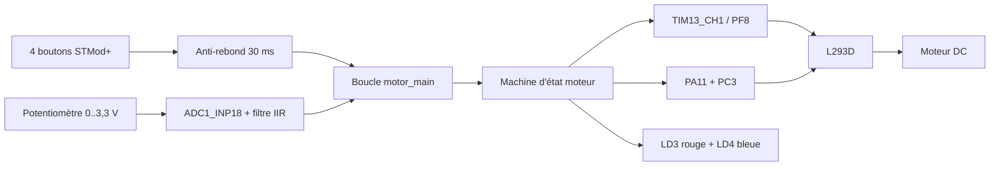
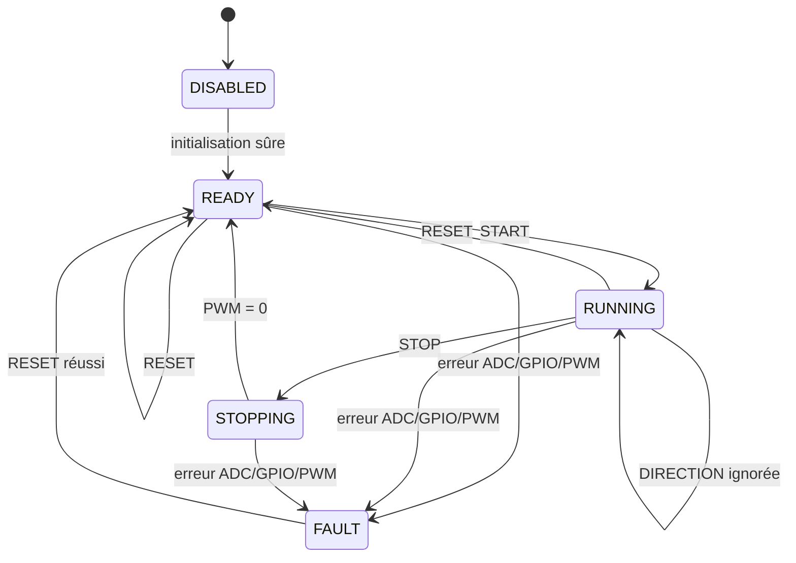

# DES04 — Contrôle moteur Cortex-M4

## Objectif

L'application M4 pilote localement un moteur DC via un L293D. Elle ne dépend ni du
réseau, ni du M7, ni de l'IPC pendant la phase 9.

## Contexte d'exécution

| Élément | Valeur |
|---|---|
| Cœur | Cortex-M4 à 200 MHz |
| Tâche | Thread Zephyr `main` (`motor_main`) |
| Stack | 2048 octets |
| Priorité | Préemptive 5 |
| Période | 10 ms |
| Anti-rebond | 3 échantillons, soit 30 ms |
| ADC | ADC1_INP18 sur PA4, 12 bits, lecture toutes les 10 ms |
| Filtrage | IIR 1/8 et zone morte de 4 ‰ |
| PWM | TIM13_CH1, 5 kHz, consigne 800 à 1000 ‰ |
| Démarrage | Boost 1000 ‰ pendant 250 ms |
| Rampe RUNNING | 1000 ‰/s vers la consigne |
| Rampe STOPPING | 4000 ‰/s vers zéro |

## Machine d'état

- Le PWM et `IN1/IN2` sont mis à zéro au boot, après la rampe d'arrêt, au reset
  et en défaut.
- `STOP` est prioritaire sur toutes les commandes du même cycle.
- `RESET` et les erreurs coupent immédiatement le pont, sans rampe.
- La direction ne change que lorsque le moteur est arrêté.
- Aucun redémarrage automatique n'est effectué après un boot ou un défaut.

## Allocation STMod+ P2

| P2 | MCU | Usage |
|---:|---|---|
| 14 | PF8 | PWM L293D `EN1,2` |
| 1 | PA11 | L293D `IN1` via SB32 |
| 2 | PC3 | L293D `IN2` via SB34 |
| 8 | PB15 | START |
| 9 | PB14 | STOP |
| 3 | PC2 | DIRECTION via SB36 |
| 12 | PJ13 | RESET |
| 13 | PA4 | Curseur potentiomètre, ADC1_INP18 |

Les broches P2.1, P2.2 et P2.3 utilisent le routage SPI d'origine de la carte
principale (SB32, SB34 et SB36 fermés). Les broches PD12/PD13 restent réservées à
l'I2C4 du LCD M7. PC6, PC7, PB9 et PB8 restent au SDMMC1 du M7. Les fonctions
audio qui partagent PC3, PJ13 et PB14 ne doivent pas être activées simultanément.

## Signalisation

| État | LD4 bleue | LD3 rouge |
|---|---|---|
| DISABLED | Éteinte | Éteinte |
| READY | Clignotement 1 Hz | Éteinte |
| RUNNING | Allumée | Éteinte |
| STOPPING | Clignotement rapide | Éteinte |
| FAULT | Éteinte | Allumée |

## Sources

- `main.c` : boucle, arbitrage des boutons et LED.
- `motor_buttons.c` : lecture et anti-rebond.
- `motor_control.c` : état, direction et PWM.
- `motor_potentiometer.c` : acquisition ADC, filtrage et conversion en consigne.
- `boards/stm32h747i_disco_stm32h747xx_m4.overlay` : câblage STMod+.
