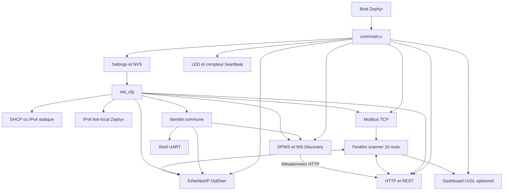

# Architecture du firmware

Ce répertoire contient les fonctionnalités applicatives du firmware Zephyr pour
la STM32H747I-DISCO M7. Cette page est le point d'entrée conseillé avant toute
modification. Chaque module possède ensuite son propre document `DES04_*.md`.

## Vue globale



## Ordre de démarrage

`main()` initialise les modules dans cet ordre :

1. LED, callback DHCP et sous-système Settings ;
2. chargement puis application de la configuration réseau ;
3. serveur Modbus TCP ;
4. adaptateur EtherNet/IP ;
5. serveur HTTP ;
6. service DPWS ;
7. écran LCD, si le build LVGL est actif ;
8. boucle permanente LED/heartbeat toutes les 500 ms.

Un échec d'un protocole est journalisé mais ne bloque pas le démarrage des
protocoles suivants. L'absence d'interface réseau ou de LED arrête en revanche
`main()`.

## Threads et workqueues applicatifs

Dans Zephyr, une valeur de priorité numérique plus petite est plus prioritaire.
Les priorités négatives sont coopératives et les positives préemptibles.

| Fonction | Nom Zephyr | Contexte | Stack | Priorité | Source |
|---|---|---|---:|---:|---|
| Orchestration et heartbeat | `main` | thread principal | 4096 octets | 0 | `CONFIG_MAIN_*` |
| Modbus TCP | `modbus_tcp` | thread dédié | 4096 octets | 7 | `app_modbus_tcp.c` |
| Commandes persistantes Modbus | `modbus_cmd_wq` | workqueue dédiée | 3072 octets | 8 | `app_modbus_tcp.c` |
| EtherNet/IP | `opener` | thread dédié | 12288 octets | 7 | `app_eip.c` |
| HTTP/REST | `app_web` | thread dédié | 6144 octets | 8 | `app_web.c` |
| DPWS/WS-Discovery | `dpws` | thread dédié | 4096 octets | 8 | `app_dpws.c` |
| LCD/LVGL | `app_lcd` | thread dédié optionnel | 4096 octets | 9 | `app_lcd.c` |
| Reboots différés | workqueue système | work items | 1024 octets | -1 | Kconfig généré |
| Événements réseau | thread net management | thread Zephyr | 2048 octets | défaut Zephyr | `prj.conf` |
| Commandes UART | thread shell | thread Zephyr | 2048 octets | défaut Zephyr | Kconfig généré |

Les tailles et priorités applicatives sont des constantes locales. Les valeurs
Zephyr indiquées correspondent au build courant ; vérifier
`build/zephyr/.config` après un changement de configuration.

## Contrats partagés à préserver

- `net_cfg` est l'unique propriétaire de la configuration IPv4 persistante.
- `ident` est l'unique source pour le nom, le modèle, la version firmware, le
  hardware ID, la MAC, les adresses IP et le UUID.
- le tableau Unit-ID 1 Modbus est protégé par `holding_regs_lock` ; passer par
  les API publiques depuis Web, LCD et EIP ;
- la fenêtre scanner contient dix mots et constitue le contrat de données
  commun avec les assemblies EtherNet/IP 100/101 ;
- les objets LVGL ne doivent être créés ou modifiés que par `app_lcd` ;
- conserver `CONFIG_NET_MAX_CONN=16` au minimum : une valeur de 8 a déjà causé
  des refus HTTP avec EIP Class 1 et un client Modbus simultanés.

## Documentation par fonctionnalité

- [Orchestration et identité](core/DES04_Core.md)
- [Configuration réseau](net/DES04_Network.md)
- [Modbus TCP et scanner](protocols/modbus/DES04_Modbus.md)
- [EtherNet/IP et OpENer](protocols/eip/DES04_EtherNetIP.md)
- [DPWS et WS-Discovery](protocols/dpws/DES04_DPWS.md)
- [Serveur HTTP et interface Web](web/DES04_Web.md)
- [Écran LCD et LVGL](ui/DES04_LCD.md)
- [Shell UART](shell/DES04_Shell.md)

## Validation minimale après une modification

```bash
west build -p always -b stm32h747i_disco/stm32h747xx/m7 app_m7
python tools/eip_probe.py <ip-carte>
python tools/dpws_probe.py
```

Pour l'image LCD :

```bash
west build -p always -b stm32h747i_disco/stm32h747xx/m7 app_m7 -- \
  -DSHIELD=st_b_lcd40_dsi1_mb1166 -DEXTRA_CONF_FILE=lcd.conf
```

Valider aussi le boot UART, le ping IPv4/IPv6, le dashboard, les lectures et
écritures Modbus, puis les connexions simultanées HTTP, Modbus et EIP.
