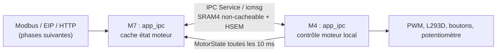

# Architecture — IPC M7 ↔ M4

## Objectif

Le M7 est la passerelle réseau et le M4 reste l'autorité du moteur. Le module IPC
transporte des messages versionnés sans partager directement des structures en
mémoire entre les caches des deux cœurs.



## Exécution

| Élément | M7 | M4 |
|---|---|---|
| Endpoint IPC | `motor-control` | `motor-control` |
| Tâche dédiée | Aucune : callbacks `icmsg` | Aucune : publication depuis `motor_main` |
| Priorité / stack | Callbacks dans le contexte IPC Zephyr | `motor_main`, priorité 5, stack 2048 octets |
| Mémoire transport | SRAM4 RX/TX 32 KiB non-cacheable | SRAM4 RX/TX 32 KiB non-cacheable |
| Cadence état | Lecture du cache, sans attente IPC | publication périodique à 10 ms |

## Contrat

`app_shared/app_ipc_protocol.h` porte l'en-tête commun : magic, version, type,
séquence et longueur de payload en little-endian. `app_shared/app_motor_contract.h`
définit les images suivantes :

- commande M7 → M4 : 10 mots ; réservée à l'étape 10.3 ;
- état M4 → M7 : 12 mots ; publié dès l'étape 10.2.

L'état contient notamment les flags moteur, PWM appliqué et cible, direction,
défaut, boutons, potentiomètre, durée de boucle et heartbeat. Le cache M7 est
protégé par un spinlock et déclaré périmé au-delà de 100 ms.

## Diagnostics

Depuis le shell M7 :

```text
m4 status   # endpoint connecté
m4 ping     # aller-retour IPC ponctuel
m4 state    # snapshot local du cache M7
```

`m4 state` ne contacte pas le M4. C'est précisément ce comportement qui permet,
dans les étapes suivantes, de répondre à des scrutations PLC rapides sans bloquer
Modbus, EtherNet/IP ou HTTP.
