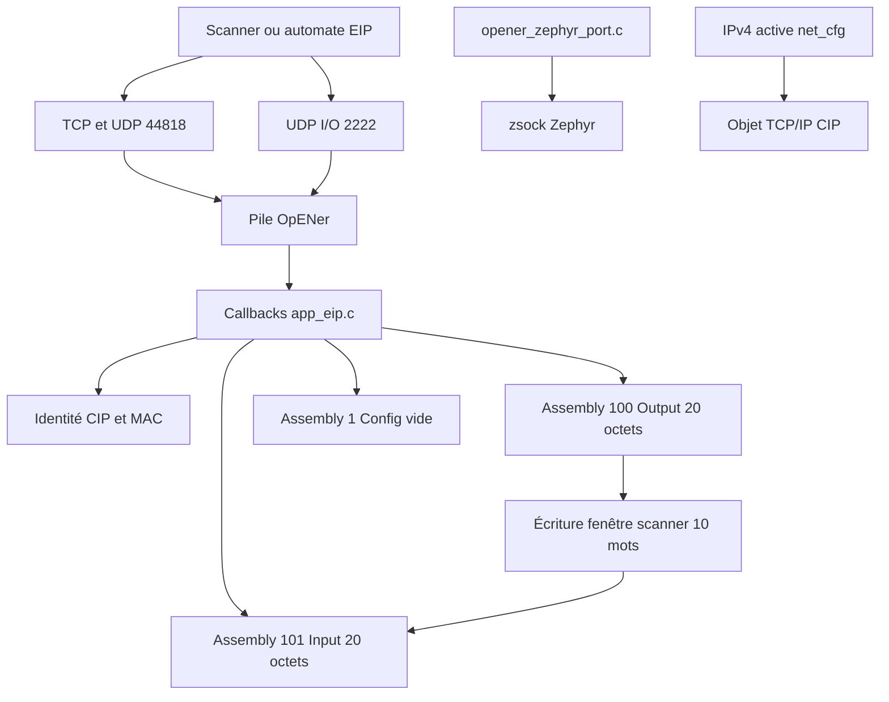

# EtherNet/IP avec OpENer

Ce module transforme l'application Zephyr en adaptateur EtherNet/IP. La pile
CIP provient du submodule `app_m7/third_party/opener`; le dossier local contient
l'intégration applicative et l'adaptation des sockets BSD vers Zephyr.

## Architecture



## Contexte d'exécution et mémoire

| Élément | Valeur |
|---|---|
| nom du thread | `opener` |
| stack | 12288 octets |
| priorité | 7 |
| heap privé CIP | 32768 octets, allocations non bloquantes |
| période interne OpENer | 10 ms |

Le thread attend une IPv4 non nulle, initialise CIP, configure les sockets,
puis exécute `NetworkHandlerProcessCyclic()`. Les callbacks assemblies sont
appelés dans ce même contexte. Le reboot CIP est différé de 250 ms sur la
workqueue système.

## Contrat CIP

| Élément | Valeur |
|---|---|
| TCP/UDP encapsulation | 44818 |
| UDP implicit I/O | 2222 |
| Assembly configuration | instance 1, vide |
| Assembly Output O-to-T | instance 100, 10 mots, 20 octets |
| Assembly Input T-to-O | instance 101, 10 mots, 20 octets |
| type de connexion | Exclusive Owner |
| sessions explicites max | 6 |
| connexions Exclusive Owner max | 1 |

Les mots d'assemblies sont little-endian. Une réception sur l'assembly 100
écrit les dix slots du scanner Modbus. Avant l'envoi de l'assembly 101, les dix
slots sont relus. Modifier leur taille exige de modifier ensemble
`APP_EIP_ASSEMBLY_WORD_COUNT`, les tailles d'assemblies et le contrat scanner.

## Identité CIP

`devicedata.h` porte Vendor ID, Device Type, Product Code et révisions. Le nom
et les révisions firmware proviennent de `ident.h`. Au démarrage :

- la MAC Zephyr alimente l'objet Ethernet Link ;
- le numéro de série CIP est construit avec les quatre derniers octets de MAC,
  ou vaut `APP_EIP_SERIAL_NUMBER_FALLBACK` si la MAC est indisponible ;
- l'adresse, le masque, la gateway, le mode DHCP/statique et le hostname
  alimentent l'objet TCP/IP CIP.

Ces valeurs sont propres à CIP. La signature Modbus `0x0747` ne doit pas être
réutilisée comme Product Code ou numéro de série.

## Port Zephyr

`platform_network_includes.h`, `sys/socket.h` et `netinet/in.h` fournissent les
types et macros attendus par OpENer. `opener_zephyr_port.c` adapte notamment :

- création, bind, listen, accept, send et receive vers `zsock_*` ;
- `SO_BROADCAST`, inutile comme gate dans Zephyr ;
- `IP_MULTICAST_IF`, dont la structure attendue diffère ;
- mode non bloquant, QoS/IP_TOS et fermeture des sockets ;
- temps monotone via `k_uptime_get()`.

Éviter de modifier les sources du submodule pour un besoin spécifique Zephyr :
préférer cette couche de portage ou les callbacks applicatifs.

## Gestion des connexions et reset

`io_connection_count` compte atomiquement les connexions I/O actives et sert au
diagnostic. `RunIdleChanged()` met à jour l'état étendu de l'objet Identity.
`ResetDevice()` ferme les connexions puis planifie un reboot. Le factory reset
reste refusé tant que l'effacement Settings n'est pas atomique.

## Configuration et capacité réseau

Les sources OpENer intégrées sont listées dans `CMakeLists.txt`. Les principales
limites sont dans `opener_user_conf.h`. Conserver assez de contextes et de
connexions Zephyr : `CONFIG_NET_MAX_CONN=16` est le minimum validé pour faire
coexister EIP Class 1, Modbus et HTTP.

## Validation

```bash
python tools/eip_probe.py <ip-carte>
```

Compléter avec Wireshark (`enip || cip`) et un scanner EIP ouvrant une connexion
Class 1 sur 100/101. Vérifier que les dix mots suivent la fenêtre scanner et que
Web plus un client Modbus idle restent accessibles.
