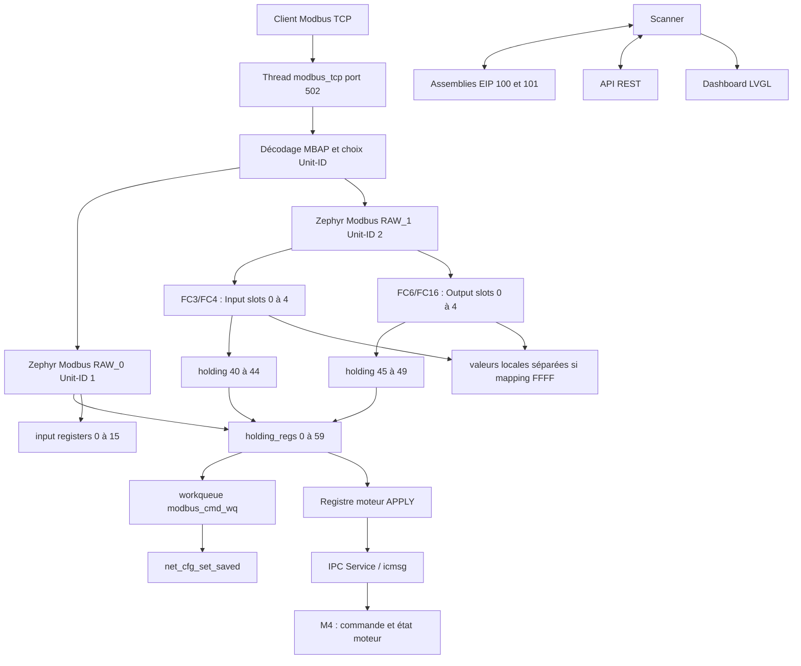

# Modbus TCP et fenêtre scanner

Ce module implémente le serveur Modbus TCP IPv4 sur le port 502, le contrat de
60 holding registers du Unit-ID 1 et deux images scanner directionnelles de
cinq mots sur le Unit-ID 2. Le refactoring EtherNet/IP, Web et LCD vers ces
deux images est réalisé dans les sous-livrables suivants de la phase 10.4.

## Architecture

## Threads et synchronisation

| Fonction | Nom | Stack | Priorité | Blocage possible |
|---|---|---:|---:|---|
| serveur TCP | `modbus_tcp` | 4096 octets | 7 | `accept`, `recv`, réponse RAW |
| sauvegarde réseau | `modbus_cmd_wq` | 3072 octets | 8 | écriture Settings/NVS |

- `holding_regs_lock` protège les 60 holding registers et l'état de commande.
- `scanner_local_regs_lock` protège les valeurs locales Input, Output et la
  zone de compatibilité temporaire utilisée par EIP/Web.
- `raw_response_ready` synchronise le serveur socket avec le backend Modbus
  RAW Zephyr.
- `command_done` synchronise la FC d'écriture avec la sauvegarde asynchrone.
- Le serveur traite un client et une requête à la fois. Une connexion idle
  conserve le thread dans `recv` et bloque les nouveaux clients Modbus.

## Routage des Unit-ID

| Unit-ID | Vue | Fonctions principales |
|---:|---|---|
| 0 ou 1 | mapping principal | holding/input registers, FC standard et FC23 |
| 2 | scanner directionnel | FC3/FC4 lisent Input ; FC6/FC16 écrivent Output ; FC23 écrit Output puis lit Input |
| autre | non supporté | connexion arrêtée avec journal d'avertissement |

Le backend Zephyr traite les PDU via deux interfaces RAW, tandis que
`app_modbus_tcp.c` possède le framing TCP/MBAP et le socket réseau.

## Contrat Unit-ID 1

La source de vérité est `modbus_map.h`.

### Holding registers

| Adresse | Usage |
|---:|---|
| 0 | signature du mapping `0x0747` |
| 1 | mode réseau sauvegardé, DHCP 0 ou statique 1 |
| 2-3 | IPv4 sauvegardée, MSW puis LSW |
| 4-5 | masque sauvegardé |
| 6-7 | gateway sauvegardée |
| 8 | commande, `1` pour sauvegarder |
| 9 | résultat signé de la dernière commande, `0x7fff` pendant traitement |
| 10 | mode de commande moteur : local `0`, distant `1` |
| 11 | mot de contrôle moteur : enable, run, reverse, reset, quick stop |
| 12 | écrire `1` pour appliquer atomiquement la commande préparée au M4 ; revient à `0` |
| 13 | consigne moteur, 800 à 1000 (80 à 100 %) |
| 14-15 | rampes accélération et décélération, en millièmes par seconde |
| 16 | timeout de sécurité de la commande distante, 100 à 10000 ms |
| 17 | résultat signé de l'envoi IPC, `0x7fff` pendant l'envoi |
| 18 | séquence de commandes Modbus mises en file sur le M7 |
| 19 | réservé, lecture seule |
| 20-31 | snapshot M4 en lecture seule : flags, consigne appliquée/cible, direction, défaut, boutons, potentiomètre, âges, heartbeat, séquence M4 |
| 32-39 | mots applicatifs disponibles, lecture/écriture |
| 40-44 | mapping des slots Input scanner 0-4 |
| 45-49 | mapping des slots Output scanner 0-4 |
| 50-59 | mots applicatifs disponibles, lecture/écriture |

### Input registers

| Adresse | Usage |
|---:|---|
| 0-1 | signature `0x0747` et version du mapping `1` |
| 2-3 | uptime en secondes, LSW puis MSW |
| 4-5 | mode actif et état du lien |
| 6-11 | IPv4, masque et gateway actifs |
| 12 | heartbeat 16 bits |
| 13 | dernier statut signé |
| 14 | nombre cumulé de connexions TCP acceptées |
| 15 | réservé |

`APP_MODBUS_MAP_SIGNATURE` identifie ce contrat de registres ; ce n'est ni un
Product Code CIP ni une version firmware.

## Pilotage du moteur via Modbus

Toutes les adresses ci-dessous sont des adresses Modbus **zéro-based**, telles
qu'elles sont définies dans `modbus_map.h`. Le client doit utiliser le Unit-ID
`1`.

Le moteur est commandé en deux temps afin qu'un PLC puisse écrire une
configuration complète sans que le M4 n'observe un état intermédiaire :

1. écrire les valeurs préparées dans `REG10`, `REG11` et `REG13..REG16` ;
2. écrire la valeur `1` dans `REG12` (`APPLY`).

Une écriture dans ces registres seule ne change pas le moteur. `REG12` revient
automatiquement à `0` après l'envoi IPC. Lire `REG17` ensuite : `0` signifie
que le M7 a mis la commande en file pour le M4 ; une autre valeur est une erreur
signée Zephyr encodée sur 16 bits.

### Registres de commande

| Registre | Nom | Valeurs et rôle |
|---:|---|---|
| 10 | mode | `0` : restitue le contrôle local au M4 ; `1` : contrôle distant Modbus |
| 11 | contrôle | combinaison des bits ci-dessous |
| 12 | APPLY | écrire uniquement `1` pour transmettre la commande préparée |
| 13 | consigne | `800..1000`, soit 80 à 100 % de PWM |
| 14 | rampe d'accélération | millièmes par seconde ; `1000` correspond à une montée 0 à 100 % en environ une seconde |
| 15 | rampe d'arrêt | millièmes par seconde ; `4000` correspond à une descente 100 à 0 % en environ 250 ms |
| 16 | timeout distant | `100..10000` ms ; le M4 arrête le moteur si le M7 ne rafraîchit plus la commande |

Bits utilisables dans `REG11` :

| Bit | Masque | Signification |
|---:|---:|---|
| 0 | `0x0001` | enable : autorise le démarrage |
| 1 | `0x0002` | run : demande la marche ; absent, le moteur s'arrête avec la rampe de `REG15` |
| 2 | `0x0004` | reverse : sens inverse ; changer le sens uniquement lorsque le moteur est arrêté |
| 3 | `0x0008` | reset fault : efface un défaut ou le verrouillage STOP physique |
| 4 | `0x0010` | quick stop : arrêt immédiat ; ne pas utiliser comme arrêt normal |

Les bits non documentés doivent rester à `0`.

### Séquences prêtes à l'emploi

Les exemples ci-dessous supposent les rampes par défaut `REG14 = 1000`,
`REG15 = 4000` et un timeout de `REG16 = 1000` ms. Après chaque séquence,
écrire `REG12 = 1`.

| Action | `REG10` mode | `REG11` contrôle | `REG13` consigne | Résultat |
|---|---:|---:|---:|---|
| démarrer vers l'avant à 80 % | `1` | `3` | `800` | enable + run, direction avant |
| démarrer vers l'avant à 100 % | `1` | `3` | `1000` | enable + run, direction avant |
| arrêt progressif | `1` | `1` | conserver | le bit run est retiré ; le M4 applique `REG15` |
| arrêt immédiat | `1` | `17` | conserver | quick stop ; le prochain start doit être une nouvelle commande explicite |
| préparer le sens inverse à l'arrêt | `1` | `5` | conserver | arrêt demandé et direction inverse préparée |
| démarrer en sens inverse | `1` | `7` | conserver | enable + run + reverse |
| acquitter un défaut | `1` | `9` | conserver | reset fault, sans demander la marche |
| rendre le contrôle aux boutons M4 | `0` | `0` | conserver | stop puis retour en mode local |

Pour une inversion sûre : envoyer d'abord l'arrêt progressif (`REG11 = 1`),
attendre l'état `ready` dans le snapshot M4, puis envoyer le démarrage inverse
(`REG11 = 7`). Le M4 refuse volontairement un changement de direction alors
que le moteur est en marche.

### Lecture et validation de l'état M4

`REG20..REG31` est une vue temps réel M4, en lecture seule. Les registres les
plus utiles pendant une mise au point sont :

| Registre | Valeur attendue |
|---:|---|
| 20 | flags : `0x00c4` est typique d'un moteur en marche en remote ; `0x00c2` est typique d'un moteur arrêté, prêt et en remote |
| 21 | consigne réellement appliquée, en millièmes |
| 22 | consigne cible, en millièmes |
| 23 | direction : `0` avant, `1` inverse |
| 24 | code défaut, `0` lorsqu'il n'y a pas de défaut |
| 27 | âge de la dernière commande M7 vers M4, en ms |
| 29 | heartbeat M4, qui doit évoluer continuellement |
| 30 | dernière séquence de commande acceptée par le M4 |

Ne pas écrire dans `REG17..REG31` : `REG17` et `REG18` sont publiés par le M7,
et `REG20..REG31` par le M4.

## Scanner directionnel Unit-ID 2

Le Unit-ID `2` conserve les adresses logiques `0..4`, mais leur direction est
déterminée par le code fonction :

| Opération Modbus | Image utilisée | Mapping Unit-ID 1 |
|---|---|---|
| FC3, FC4 | Input, lecture seule | `REG40..44` |
| FC6, FC16 | Output, écriture seule | `REG45..49` |
| FC23 | écrit Output puis lit Input | les deux mappings |

Au démarrage, les mappings sont :

| Slot | Input : valeur PLC lue | Output : valeur PLC écrite |
|---:|---|---|
| 0 | `REG24`, code défaut M4 | `REG11`, mot de contrôle moteur |
| 1 | `REG21`, consigne réellement appliquée | `REG13`, consigne vitesse |
| 2 | `0xffff`, valeur locale Input | `REG12`, APPLY / applique la commande préparée |
| 3 | `0xffff`, valeur locale Input | `0xffff`, valeur locale Output |
| 4 | `0xffff`, valeur locale Input | `0xffff`, valeur locale Output |

Une cible `0xffff` utilise une valeur locale privée au scanner concerné. Les
valeurs `0..59` sont admises comme cible de lecture ; pour Output, les zones
d'état moteur en lecture seule et les tables de mapping sont refusées. Écrire
`0` dans le slot Output 2 ne fait rien ; écrire `1` déclenche `APPLY`.

## Sauvegarde de la configuration réseau

Une écriture de `1` dans le registre 8 soumet un work item à
`modbus_cmd_wq`. Celui-ci reconstruit les chaînes IPv4, appelle
`net_cfg_set_saved()`, remet la commande à zéro et publie le résultat dans le
registre 9. Le timeout appelant est de 5 s et le timeout RAW de 6 s.

## API utilisée par les autres modules

- `app_modbus_tcp_holding_read/write()` : Web et autres producteurs locaux ;
- `app_modbus_scanner_input_reg_rd()` et `output_reg_wr()` : Unit-ID 2 ;
- `app_modbus_scanner_holding_reg_rd/wr()` : compatibilité temporaire EIP/Web/LCD ;
- `app_modbus_tcp_connection_count()` et `heartbeat_count()` : Web/LCD ;
- `app_modbus_tcp_heartbeat_tick()` : boucle `main`.

Toujours passer par ces API pour conserver les contrôles de bornes et les
mutex.

## Validation

- lire le Unit-ID 2 avec FC3 et vérifier défaut/vitesse appliquée aux slots 0/1 ;
- écrire les slots Output 0/1 avec FC6 ou FC16, puis le slot 2 à `1` ;
- tester FC23 : écriture Output suivie de lecture Input ;
- modifier un mapping Input et Output vers `0xffff`, puis vérifier leurs valeurs locales séparées ;
- écrire une commande moteur dans `10`, `11` et `13..16`, puis `1` dans `12` ; vérifier le
  snapshot M4 `20..31`, sans tenter d'écrire cette zone lecture seule ;
- sauvegarder DHCP/statique, rebooter et vérifier Settings ;
- garder un client Modbus connecté pendant les tests HTTP et EIP Class 1.
