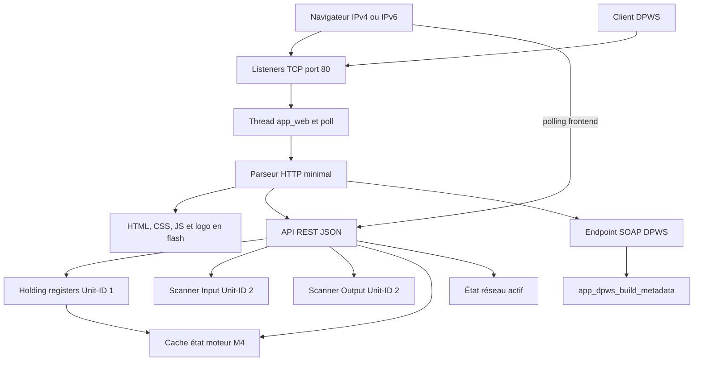

# Serveur HTTP et interface Web

Le module Web sert un dashboard statique embarqué, une API REST de supervision
et contrôle, ainsi que l'endpoint HTTP de métadonnées DPWS. Il utilise les
sockets Zephyr directement, sans serveur HTTP générique.

## Architecture



## Contexte d'exécution

| Élément | Valeur |
|---|---|
| nom du thread | `app_web` |
| stack | 6144 octets |
| priorité | 8 |
| listeners | TCP IPv4 et IPv6, port 80 |
| backlog | 4 par listener |
| buffer de requête | 1536 octets, sur la stack du thread |
| buffer JSON | 2048 octets, statique et partagé séquentiellement |
| buffer metadata DPWS | 4096 octets, statique |

Le thread utilise `poll()` sur les deux listeners, accepte un client, lit une
requête, répond puis ferme la connexion. Il n'y a ni keep-alive ni traitement
concurrent : un client lent bloque temporairement les autres requêtes HTTP.

Le reboot Web est un work item différé de 500 ms exécuté par la workqueue
système, ce qui laisse le temps d'envoyer la réponse HTTP 202.

## Routes

### Assets

| Méthode | Route | Contenu |
|---|---|---|
| GET | `/` ou `/index.html` | dashboard HTML |
| GET | `/app.css` | styles |
| GET | `/app.js` | logique frontend |
| GET | `/logo.jpg` | logo binaire embarqué |

`app_web_assets.h` contient HTML/CSS/JS sous forme de chaînes C.
`app_web_logo.h` est la représentation C de `logo.jpg`. Une modification d'un
asset doit tenir compte de la consommation flash.

### API REST

| Méthode | Route | Effet |
|---|---|---|
| GET | `/api/status` | réseau actif, lien, connexions Modbus, heartbeat, statut |
| GET | `/api/registers` | les 60 holding registers |
| GET | `/api/registers/<id>` | un holding register |
| PUT | `/api/registers/<id>` | écrit une valeur 16 bits |
| GET | `/api/scanner` | les deux images scanner et leurs mappings |
| GET | `/api/scanner/input` | image Input : 5 mots lecture seule |
| GET | `/api/scanner/output` | image Output : 5 mots inscriptibles |
| PUT | `/api/scanner/output/<id>` | écrit un mot Output, `id` de 0 à 4 |
| PUT | `/api/scanner/input-mapping/<id>` | change le mapping Input (`REG40..44`) |
| PUT | `/api/scanner/output-mapping/<id>` | change le mapping Output (`REG45..49`) |
| GET | `/api/motor/state` | dernier état M4 reçu par IPC |
| POST | `/api/motor/command` | configure une commande moteur distante et l'applique |
| POST | `/api/motor/local` | stoppe le moteur et rend le contrôle aux boutons M4 |
| POST | `/api/commands/save-config` | déclenche la sauvegarde réseau Modbus |
| POST | `/api/commands/reboot` | répond 202 puis redémarre |
| POST | `/dpws/<uuid>` | WS-Transfer Get pour les métadonnées DPWS |

Les écritures passent par les API Modbus/scanner afin de partager exactement
le même contrat et les mêmes validations que les protocoles industriels. Les
routes moteur écrivent les registres `REG11..16`, imposent le mode distant
(`REG10 = 1`) puis écrivent `APPLY` (`REG12 = 1`). L'état retourné par
`/api/motor/state` est un cache IPC M4, pas une lecture synchrone du M4.

Exemple de commande REST :

```json
{
  "control": 3,
  "duty": 800,
  "accel": 1000,
  "decel": 4000,
  "timeout": 1000
}
```

`control` est obligatoire. Les autres champs sont optionnels et conservent la
valeur déjà configurée s'ils sont absents. Les valeurs de contrôle sont les
mêmes que dans le contrat Modbus : `3` démarre en avant, `1` arrête, `5`
prépare la direction inverse à l'arrêt et `17` demande un arrêt rapide.

## Frontend

Le JavaScript interroge périodiquement l'API pour mettre à jour dashboard,
registres, les images scanner et l'état moteur. La page Scanner sépare
explicitement les cinq mots Input en lecture seule des cinq mots Output
écrits par le navigateur. Préserver les gardes `refreshInFlight` et les
indicateurs d'édition : sans elles, deux polls peuvent se chevaucher ou
remplacer une valeur que l'utilisateur est en train de saisir.

Le serveur écoute séparément en IPv4 et IPv6 avec `IPV6_V6ONLY`. Pour une IPv6
link-local, le client doit préciser l'interface, par exemple avec curl Windows :

```text
curl.exe -g "http://[fe80::80:e1ff:fe4c:b2d7%2511]/"
```

Dans une URL, `%25` encode le caractère `%` qui introduit l'index de zone.

## Limites et sécurité

- HTTP clair, sans authentification ni autorisation ;
- parseur limité à une requête contenue dans 1536 octets ;
- aucune prise en charge de chunked encoding, keep-alive ou pipeline ;
- parsing JSON minimal : seule une valeur entière 16 bits est recherchée ;
- les routes PUT, SAVE et reboot sont des interfaces de contrôle non protégées.

Toute évolution de sécurité doit protéger toutes les routes mutables, pas
seulement l'interface HTML.

## Ajouter une route

1. Définir le contrat JSON ou SOAP et ses bornes.
2. Router dans `handle_api_get`, `handle_api_put`, `handle_api_post` ou
   `handle_http_request`.
3. Utiliser l'API du module propriétaire des données.
4. Vérifier tous les retours de `snprintk` et les tailles de buffers.
5. Mettre à jour ce tableau et tester IPv4 plus IPv6.

## Validation

Tester les assets, toutes les routes, les identifiants hors bornes, une requête
malformée et les écritures supérieures à 65535. Garder simultanément une
connexion Modbus idle et une connexion EIP Class 1 pour détecter une régression
de capacité sockets.
